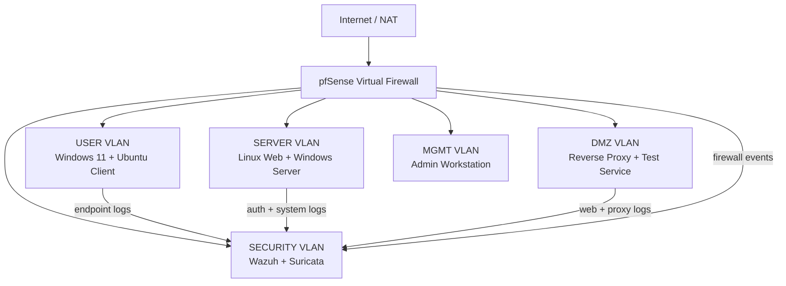

# Virtualized Security Engineering, SOC & Incident Response Lab


## Overview

This project is a segmented virtual enterprise security lab built to practice **security engineering, SOC monitoring, incident response, detection coverage analysis, network defense, and control validation** in an isolated environment. The architecture models a small enterprise using dedicated `USER`, `SERVER`, `DMZ`, `SECURITY`, and `MGMT` zones, with a virtual firewall controlling traffic between segments.

The lab combines endpoint, network, firewall, and IDS telemetry with Python-based analysis utilities, ATT&CK-oriented detection documentation, CI validation, architecture decision records, and a repeatable incident-investigation workflow. The goal is not only to generate alerts, but to demonstrate how a security analyst or engineer can move from **telemetry -> investigation -> evidence -> mitigation -> validation**.

> **Project status:** Active and continuously improved. All testing and evidence are limited to an isolated lab environment. Synthetic sample telemetry is included so the analysis and validation workflow remains reproducible without touching unauthorized systems.

## What This Project Demonstrates

- Enterprise-style network segmentation and firewall policy design
- Centralized security monitoring with Wazuh-oriented endpoint telemetry
- Network detection using Suricata-oriented IDS evidence
- SOC-style alert triage and incident investigation
- Correlation of Windows, firewall, IDS, and network evidence
- MITRE ATT&CK-oriented detection coverage analysis
- Python automation for log parsing, normalization, and analyst workflows
- Security hardening and control-validation documentation
- Architecture Decision Records (ADRs) and stakeholder-ready reporting
- GitHub Actions CI for tests, Python validation, Markdown checks, and secret scanning

## Architecture

The virtual firewall acts as the control point between network zones. Administrative activity is isolated to the management subnet, monitored systems forward security-relevant telemetry toward the security zone, and network controls restrict unnecessary east-west communication.



### Zone Purpose

| Zone | Purpose |
|---|---|
| `USER` | Represents employee/client endpoints and normal user activity |
| `SERVER` | Hosts internal services and server-side authentication/system telemetry |
| `DMZ` | Contains externally exposed test services separated from the internal network |
| `SECURITY` | Centralizes monitoring, IDS evidence, analyst tooling, and security telemetry |
| `MGMT` | Restricts administrative access to a dedicated management segment |

## SOC & Incident Response Workflow

The lab follows a repeatable investigation process designed to mirror entry-level enterprise SOC operations:

1. **Monitor** endpoint, IDS, firewall, and network telemetry.
2. **Triage** alerts based on source, severity, affected asset, and observed behavior.
3. **Correlate** related events across Windows, firewall, IDS, and packet-level evidence.
4. **Map** relevant activity to MITRE ATT&CK where the evidence supports the mapping.
5. **Investigate** the timeline, source/destination context, authentication activity, and network behavior.
6. **Recommend mitigation** such as access restrictions, segmentation changes, hardening, or additional monitoring.
7. **Validate remediation** using controlled lab testing and documented evidence.
8. **Document** the incident, findings, limitations, and follow-up actions.

See [`docs/incident-walkthrough.md`](./docs/incident-walkthrough.md) for the detailed investigation workflow.

## Evidence & Screenshots

### SIEM / Centralized Monitoring


Centralized security telemetry and alert-monitoring view used to support analyst review and triage.

### SOC Incident Walkthrough


Structured investigation workflow showing how multiple evidence sources are reviewed and correlated.

### Detection Coverage


ATT&CK-oriented detection documentation connecting available telemetry to defensive coverage themes.

### Firewall / Segmentation Validation


Validation of segmented firewall policy and controlled communication paths between lab zones.

### Security Automation Output


Python-based validation and evidence-processing utilities used to summarize security data.

### CI Validation


GitHub Actions workflow validating Python, tests, Markdown, secret scanning, and sample-evidence processing.

## Detection & Investigation Coverage

The lab includes sample scenarios and evidence supporting analysis of:

- authentication anomalies
- denied or unexpected network flows
- reconnaissance and scanning behavior
- IDS alert review and severity analysis
- Windows security event correlation
- firewall rule hits and blocked communication
- endpoint and network telemetry correlation
- segmentation-control validation
- remediation verification

The project intentionally distinguishes between what the available evidence **shows** and what it merely **suggests**, avoiding unsupported conclusions during ATT&CK mapping or incident analysis.

## Python Security Automation

The repository includes lightweight analyst utilities for parsing and summarizing evidence:

```bash
python scripts/parse_firewall_logs.py
python scripts/summarize_security_events.py
python scripts/generate_lab_inventory.py
python -m unittest discover -s tests -v
python scripts/validate_python_syntax.py .
python scripts/validate_markdown.py .
python scripts/secret_scan.py .
```

These workflows support:

- firewall action counts and rule-hit summaries
- denied-flow analysis
- IDS signature and severity summaries
- Windows event ID and account summaries
- normalized analyst timelines
- repeatable asset-inventory generation
- documentation and code-quality validation

## Security Controls Demonstrated

| Security Area | Implementation / Evidence |
|---|---|
| Network segmentation | Dedicated virtual zones with firewall-controlled communication |
| Least privilege | Administrative access isolated to the `MGMT` network |
| Centralized logging | Windows, firewall, and IDS sample telemetry |
| Detection engineering | IDS evidence, dashboard structures, and coverage documentation |
| ATT&CK mapping | Detection notes in [`docs/detection-coverage.md`](./docs/detection-coverage.md) |
| SOC triage | Investigation workflow in [`docs/incident-walkthrough.md`](./docs/incident-walkthrough.md) |
| System hardening | Defensive baseline in [`docs/hardening-checklist.md`](./docs/hardening-checklist.md) |
| Control validation | Evidence-based validation and remediation documentation |
| Architecture governance | ADRs explaining design decisions and tradeoffs |
| CI security hygiene | Unit tests, Python validation, Markdown checks, and secret scanning |

## Technology Stack

**Security & Monitoring:** Wazuh, Suricata, pfSense/OPNsense concepts, Windows Event telemetry, Linux syslog/audit concepts  
**Networking:** TCP/IP, VLAN segmentation, firewall policy, network zones, packet analysis  
**Automation:** Python 3, JSON, JSONL, CSV, YAML  
**Engineering:** Git, GitHub Actions, unit testing, Markdown validation, secret scanning  
**Frameworks / Practices:** MITRE ATT&CK, incident response, detection coverage, hardening, least privilege, evidence-based validation

## Repository Structure

```text
Virtualized_security_engineering_lab/
|-- .github/workflows/ci.yml
|-- README.md
|-- ROADMAP.md
|-- CHANGELOG.md
|-- architecture/
|   `-- security-lab-topology.mmd
|-- artifacts/
|   |-- sample-logs/
|   `-- sample-reports/
|-- configs/
|   |-- firewall-rules.csv
|   |-- suricata-lab.yaml
|   `-- wazuh-agent.conf
|-- dashboards/
|   `-- security-lab-dashboard.json
|-- docs/
|   |-- architecture-decisions/
|   |-- detection-coverage.md
|   |-- hardening-checklist.md
|   |-- incident-walkthrough.md
|   |-- lab-runbook.md
|   `-- setup-guide.md
|-- reports/
|   `-- executive-summary.md
|-- screenshots/
|-- scripts/
`-- tests/
```

## Documentation

| Document | Purpose |
|---|---|
| [`reports/executive-summary.md`](./reports/executive-summary.md) | Stakeholder-level summary of business value, controls, results, and limitations |
| [`docs/setup-guide.md`](./docs/setup-guide.md) | Lab build and validation steps |
| [`docs/lab-runbook.md`](./docs/lab-runbook.md) | Analyst operating workflow |
| [`docs/detection-coverage.md`](./docs/detection-coverage.md) | ATT&CK-oriented detection coverage |
| [`docs/incident-walkthrough.md`](./docs/incident-walkthrough.md) | SOC-style investigation walkthrough |
| [`docs/hardening-checklist.md`](./docs/hardening-checklist.md) | Host, logging, and access-control baseline |
| [`docs/architecture-decisions/`](./docs/architecture-decisions/README.md) | Architecture Decision Records |
| [`ROADMAP.md`](./ROADMAP.md) | Current and planned improvements |
| [`CHANGELOG.md`](./CHANGELOG.md) | Versioned project history |

## Setup

1. Install a local hypervisor such as VirtualBox, VMware Workstation, Proxmox, or Hyper-V.
2. Create isolated virtual networks for `USER`, `SERVER`, `DMZ`, `SECURITY`, and `MGMT`.
3. Deploy a virtual firewall and configure default-deny inter-zone rules.
4. Deploy Windows and Linux lab endpoints plus a security-monitoring host.
5. Configure endpoint telemetry/log forwarding toward the security-monitoring environment.
6. Place the IDS sensor on the designated monitoring interface.
7. Import the sample dashboard structure from [`dashboards/security-lab-dashboard.json`](./dashboards/security-lab-dashboard.json).
8. Generate only controlled or synthetic events inside the isolated lab.
9. Run the Python validation and analysis utilities to verify evidence-processing workflows.

## CI / Engineering Quality

The GitHub Actions workflow automatically:

- validates Python syntax
- runs the unit-test suite
- checks Markdown formatting
- performs a basic secret scan
- parses sample firewall evidence
- summarizes IDS and Windows events
- regenerates the lab asset inventory

See [`.github/workflows/ci.yml`](./.github/workflows/ci.yml) for the complete pipeline.

## Real-World Relevance

A lab like this can be used to safely rehearse security-engineering and SOC activities before applying similar concepts in production. It demonstrates how segmentation, centralized logging, endpoint telemetry, network detection, security automation, and structured incident response work together as layered defenses.

The project is intentionally designed to be explainable to both technical and non-technical audiences: architecture decisions are documented, controls have stated purposes, evidence is reproducible, and findings can be translated into remediation actions and stakeholder-level summaries.

## Current Roadmap

Ongoing improvements include expanding Linux authentication telemetry, adding DMZ web/proxy evidence, improving generated visualizations, increasing detection scenarios, and continuing to replace synthetic examples with sanitized evidence captured from the isolated lab where appropriate.

See [`ROADMAP.md`](./ROADMAP.md) for details.

## Ethical & Authorized Use

This project is strictly for defensive learning in systems that are owned, controlled, or explicitly authorized for testing. Do not deploy scanners, agents, traffic-generation tools, or security tests against systems without permission.
