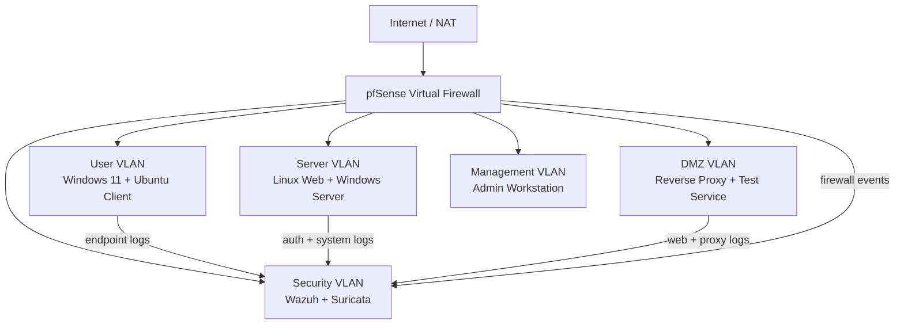
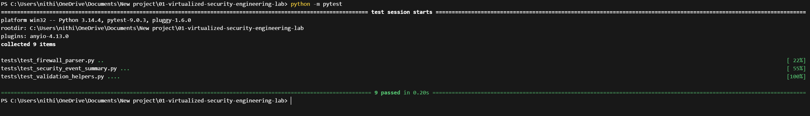
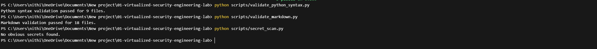
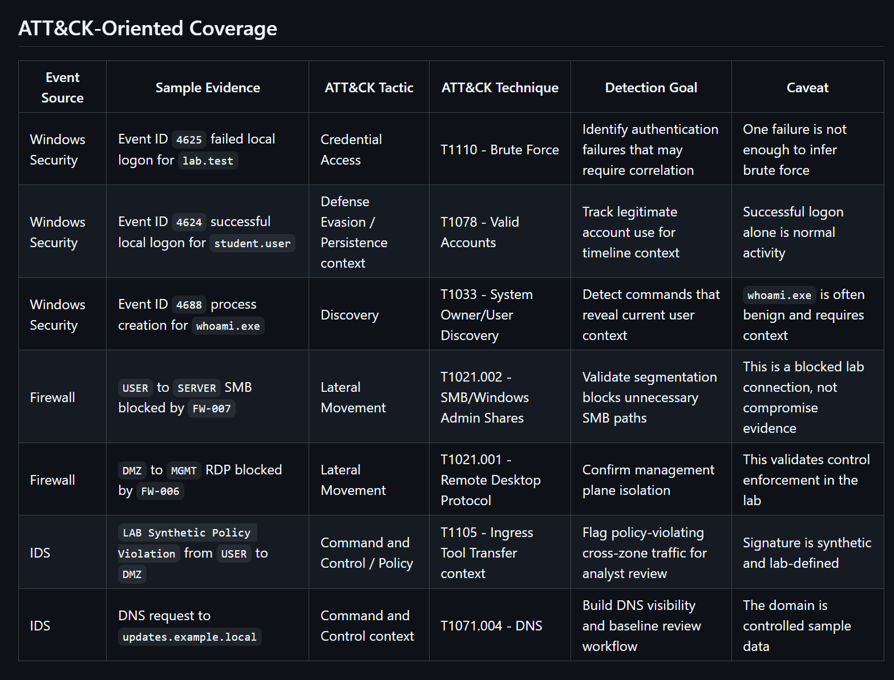
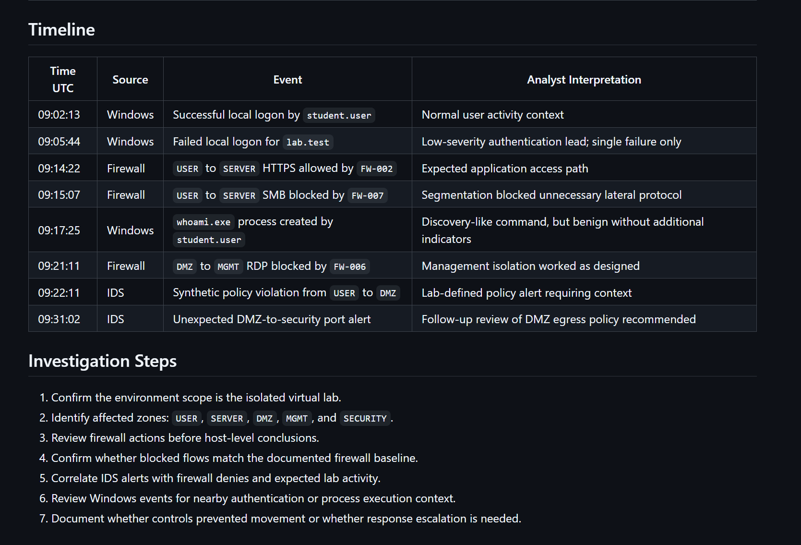
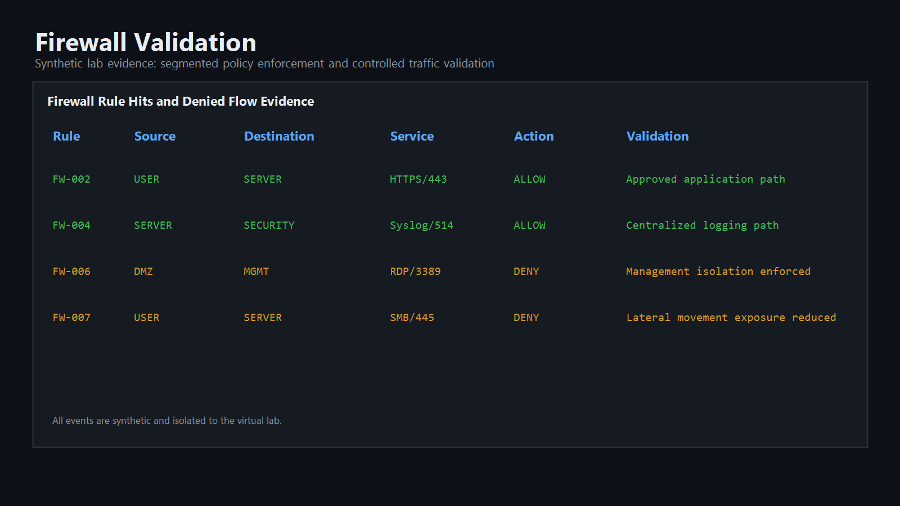
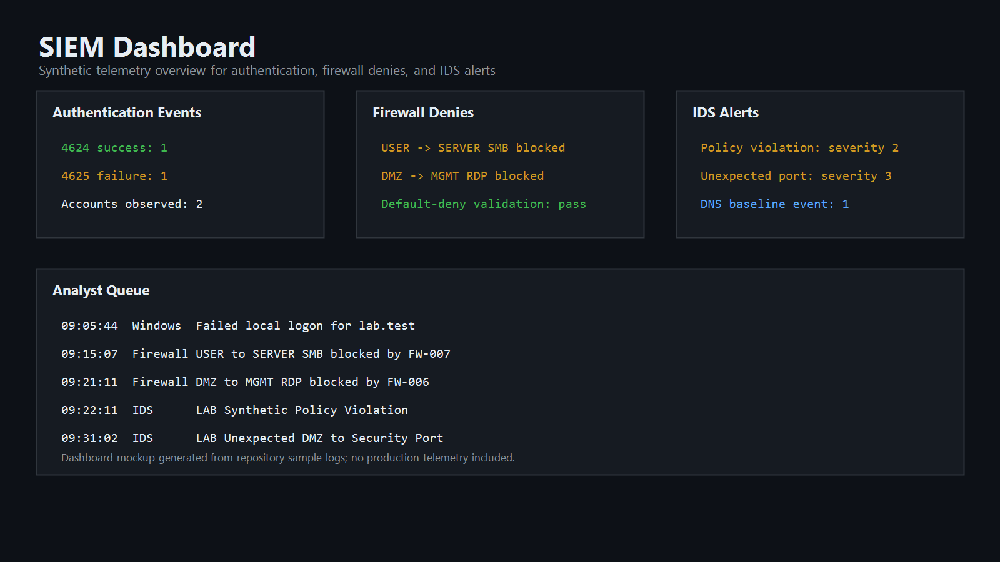

# Virtualized Security Engineering Lab


## Executive Summary

This project designs a segmented virtual enterprise security lab for practicing defensive engineering, telemetry collection, system hardening, detection coverage analysis, and control validation. The lab is built around a realistic small-business network model with user, server, DMZ, management, and security monitoring zones.

The deliverables show how a security engineer can plan a lab, document architecture, collect evidence, write lightweight validation tooling, and explain layered controls without touching any unauthorized environment.

## Architecture Diagram Description

The lab uses a virtual firewall as the control point between zones. Windows and Linux hosts forward logs to a Wazuh-style manager. A Suricata-style IDS sensor monitors mirrored lab traffic and produces synthetic alert evidence. Administrative access is isolated to a management subnet.



## Folder Structure

```text
01-virtualized-security-engineering-lab/
|-- .github/workflows/ci.yml
|-- .gitignore
|-- CHANGELOG.md
|-- CONTRIBUTING.md
|-- README.md
|-- ROADMAP.md
|-- requirements.txt
|-- architecture/
|   `-- security-lab-topology.mmd
|-- artifacts/
|   |-- sample-logs/
|   |   |-- firewall.log
|   |   |-- ids-alerts.jsonl
|   |   `-- windows-security-events.jsonl
|   `-- sample-reports/
|       |-- lab-asset-inventory.md
|       `-- lab-validation-report.md
|-- configs/
|   |-- firewall-rules.csv
|   |-- suricata-lab.yaml
|   `-- wazuh-agent.conf
|-- dashboards/
|   `-- security-lab-dashboard.json
|-- docs/
|   |-- architecture-decisions/
|   |   |-- ADR-0001-segmented-virtual-network.md
|   |   |-- ADR-0002-synthetic-telemetry.md
|   |   |-- ADR-0003-standard-library-automation.md
|   |   `-- README.md
|   |-- detection-coverage.md
|   |-- hardening-checklist.md
|   |-- incident-walkthrough.md
|   |-- lab-runbook.md
|   `-- setup-guide.md
|-- reports/
|   `-- executive-summary.md
|-- screenshots/
|   `-- README.md
|-- scripts/
|   |-- generate_lab_inventory.py
|   |-- parse_firewall_logs.py
|   |-- secret_scan.py
|   |-- summarize_security_events.py
|   |-- validate_markdown.py
|   `-- validate_python_syntax.py
`-- tests/
    |-- test_firewall_parser.py
    |-- test_security_event_summary.py
    `-- test_validation_helpers.py
```

## Documentation Index

| Document | Purpose |
|----------|---------|
| [`reports/executive-summary.md`](./reports/executive-summary.md) | Stakeholder-level summary of business value, controls, results, and limitations |
| [`docs/setup-guide.md`](./docs/setup-guide.md) | Local lab build and validation steps |
| [`docs/lab-runbook.md`](./docs/lab-runbook.md) | Daily operating workflow and analyst review process |
| [`docs/detection-coverage.md`](./docs/detection-coverage.md) | MITRE ATT&CK-oriented mapping of synthetic events to detection themes |
| [`docs/incident-walkthrough.md`](./docs/incident-walkthrough.md) | SOC-style investigation using the sample telemetry |
| [`docs/hardening-checklist.md`](./docs/hardening-checklist.md) | Defensive baseline for hosts, logging, and access control |
| [`docs/architecture-decisions/`](./docs/architecture-decisions/README.md) | Architecture Decision Records explaining key design choices |
| [`ROADMAP.md`](./ROADMAP.md) | Completed work and future improvement plan |
| [`CHANGELOG.md`](./CHANGELOG.md) | Versioned project history |

## Setup Instructions

1. Install a local hypervisor such as VirtualBox, VMware Workstation, Proxmox, or Hyper-V.
2. Create virtual networks for `USER`, `SERVER`, `DMZ`, `SECURITY`, and `MGMT`.
3. Deploy a virtual firewall and configure default-deny inter-VLAN rules.
4. Deploy one Windows endpoint, one Linux endpoint, and one Linux security monitoring host.
5. Configure endpoint log forwarding to the Wazuh manager.
6. Place the IDS sensor on the lab monitoring interface.
7. Import the sample dashboard structure from [`dashboards/security-lab-dashboard.json`](./dashboards/security-lab-dashboard.json).
8. Use synthetic test events only; do not scan or test systems outside the isolated lab.

## Analyst Utility Commands

Run these commands from the project root:

```bash
python scripts/parse_firewall_logs.py
python scripts/summarize_security_events.py
python scripts/generate_lab_inventory.py
python -m unittest discover -s tests -v
python scripts/validate_python_syntax.py .
python scripts/validate_markdown.py .
python scripts/secret_scan.py .
```

Expected outputs include:

- firewall action counts, rule hits, and denied flow summaries
- IDS alert signature and severity counts
- Windows event ID and account summaries
- a normalized analyst timeline from IDS and Windows events
- regenerated asset inventory documentation
- unit test results for the Python helpers

## Screenshots

### GitHub Actions CI Validation

Shows automated validation workflows successfully completing for Markdown checks, Python validation, secret scanning, and unit tests.



### Validation Script Execution

Demonstrates successful execution of validation and security hygiene tooling.



### Detection Coverage Review

Illustrates ATT&CK-oriented detection coverage documentation and telemetry mapping.



### SOC Incident Walkthrough

Shows the structured investigation workflow for analyzing synthetic alerts and correlated telemetry.



### Firewall Validation

Demonstrates segmented firewall policy enforcement and controlled traffic validation.



### SIEM Dashboard

Displays centralized telemetry and alert monitoring within the virtual lab environment.



## Technical Explanation

This lab demonstrates layered defensive architecture. The firewall enforces segmentation, endpoint agents collect host-level telemetry, network sensors provide visibility into traffic patterns, and the SIEM centralizes alerting. The lab is intentionally small enough to run on a student workstation while still reflecting enterprise principles: zone separation, centralized monitoring, asset inventory, baseline hardening, detection coverage mapping, tested evidence parsers, and validation reporting.

## Security Concepts Demonstrated

| Concept | Evidence |
|---------|----------|
| Network segmentation | Dedicated virtual zones and firewall rule baseline |
| Least privilege | Management access isolated to the `MGMT` subnet |
| Centralized logging | Synthetic Windows, firewall, and IDS logs |
| Detection engineering | IDS alert examples and dashboard fields |
| ATT&CK mapping | Detection coverage notes in `docs/detection-coverage.md` |
| SOC triage | Investigation walkthrough in `docs/incident-walkthrough.md` |
| Hardening | Baseline checklist mapped to host and network controls |
| Control validation | Lab validation report with findings and remediation notes |
| Architecture governance | ADRs documenting key design decisions |
| CI hygiene | Unit tests, Markdown validation, Python syntax checks, and basic secret scanning |

## Tools And Technologies

- pfSense or OPNsense
- Wazuh
- Suricata
- Windows Event Forwarding concepts
- Linux audit and syslog
- Python 3 standard library
- GitHub Actions
- Markdown, Mermaid, JSON, JSONL, CSV, YAML

## Key Features

- Enterprise-style segmented lab topology
- SIEM and IDS evidence artifacts
- Firewall baseline with business justification
- Host hardening checklist
- Validation report and executive summary
- Inventory generator script for documentation hygiene
- Defensive parsing scripts for firewall, IDS, and Windows evidence
- Unit tests for Python evidence-processing helpers
- ATT&CK-oriented detection coverage matrix
- SOC-style incident walkthrough
- Architecture decision records, roadmap, and changelog
- GitHub Actions workflow for tests, documentation, Python, and secret-scan validation

## Real-World Use Case

A security engineering team can use this type of lab to test logging pipelines, validate segmentation, train junior analysts, evaluate detection coverage, and safely rehearse incident response workflows before applying changes in production.

## Resume Bullet Points

- Designed a segmented virtual security engineering lab with firewall-controlled `USER`, `SERVER`, `DMZ`, `SECURITY`, and `MGMT` zones.
- Implemented centralized telemetry examples using Wazuh-style endpoint logs, Suricata-style IDS alerts, and firewall event samples.
- Created security hardening, network rule, ATT&CK mapping, and validation documentation to demonstrate control design and evidence-based remediation.
- Built tested Python utilities to parse synthetic firewall logs, summarize IDS and Windows events, and support repeatable CI validation.
- Added architecture decision records and an executive summary report to communicate technical decisions and business value.

## Interview Talking Points

- Why segmentation matters and how default-deny rules reduce blast radius.
- How endpoint telemetry and network telemetry complement each other.
- How to explain a lab architecture to both technical and non-technical audiences.
- How to validate that controls are working using synthetic evidence.
- How to map telemetry to MITRE ATT&CK without overstating what the evidence proves.
- How to walk through a SOC investigation using endpoint, firewall, and IDS data.
- Why architecture decision records improve technical communication.
- What tradeoffs exist when building a realistic lab on limited hardware.

## Future Improvement Roadmap

See [`ROADMAP.md`](./ROADMAP.md) for the full roadmap. Near-term priorities are real isolated-lab screenshots, generated charts from parser output, Linux authentication samples, and web proxy logs from the DMZ.

## Ethical Notice

This project is designed for isolated lab learning. Do not run scans, collection agents, or network tests against systems you do not own or administer.
